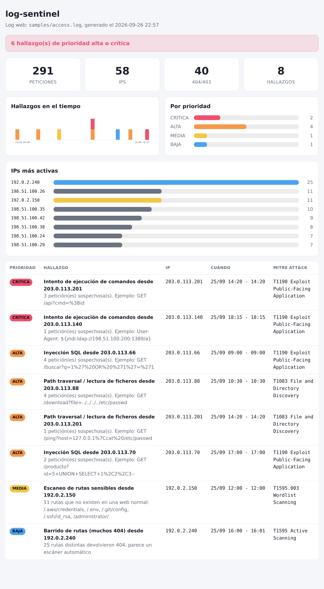

# log-sentinel

[](https://github.com/espi0207/log-sentinel/actions/workflows/ci.yml)

Herramienta de línea de comandos que lee logs de SSH (`auth.log`) y de servidores
web (nginx y Apache) y busca señales de ataque: fuerza bruta, password spraying,
accesos que llegan después de muchos fallos, inyección SQL, path traversal,
escaneos... Puede analizar un log que ya existe o quedarse vigilándolo y mandar un
aviso a Telegram o Discord cuando pasa algo grave.

Quería entender cómo se ve un ataque desde el lado del que defiende. Cualquier
servidor con SSH abierto a internet recibe intentos de login a todas horas, y la
mayoría son ruido; lo interesante es separar lo que importa. Cada hallazgo lleva
su técnica de MITRE ATT&CK.

Solo usa la biblioteca estándar de Python, no tiene dependencias.

## Instalación

Hace falta Python 3.10 o superior.

```bash
git clone https://github.com/espi0207/log-sentinel.git
cd log-sentinel
python -m venv .venv
source .venv/bin/activate        # en Windows: .venv\Scripts\activate
pip install -e .
```

El repo trae configuración de devcontainer, así que también se puede abrir en
GitHub Codespaces y probarlo sin instalar nada.

## Uso

En `samples/` hay dos logs inventados con varios ataques mezclados con tráfico
normal (las IPs son de los rangos reservados para documentación, no son de nadie):

```bash
logsentinel samples/auth.log
logsentinel samples/access.log --web
```

La salida del primero, recortada:

```text
log-sentinel: samples/auth.log
Periodo: 2026-09-25 06:00:00 -> 2026-09-25 19:19:00
128 eventos, 89 fallos, 21 accesos, 12 IPs con fallos, 7 hallazgos

[CRÍTICA] Acceso correcto de 'backup' desde 203.0.113.99 tras 8 fallos
          2026-09-25 15:41:14 -> 15:42:29  (T1078 Valid Accounts)
          método: password. Posible credencial adivinada: comprueba la sesión, cambia la contraseña y revisa qué se hizo con esa cuenta

[ALTA]    Ataque distribuido contra la cuenta 'admin'
          2026-09-25 08:00:41 -> 12:51:00  (T1110 Brute Force)
          15 fallos desde 8 IPs distintas (típico de una botnet)

[MEDIA]   Fuerza bruta desde 203.0.113.45
          2026-09-25 07:15:02 -> 07:17:40  (T1110.001 Password Guessing)
          40 fallos en 5 min (40 en total, 1 usuario(s); el más atacado: root)
...
```

Y algunas opciones más:

```bash
logsentinel auth.log --format md > informe.md       # informe en Markdown
logsentinel auth.log --format json > informe.json   # para meterlo en otra herramienta
logsentinel auth.log --blocklist bloquear.txt --allow 10.0.0.0/8   # IPs atacantes, sin las de tu red
logsentinel auth.log auth.log.1 auth.log.2.gz       # varios ficheros, también los rotados
journalctl -u ssh -o short-iso | logsentinel -      # desde la entrada estándar
```

Si encuentra algo de prioridad alta o crítica sale con código 1, así que se puede
poner en cron y que solo moleste cuando hace falta:

```cron
0 * * * * logsentinel /var/log/auth.log > /dev/null || /usr/local/bin/avisar.sh
```

### Vigilar en vivo

```bash
logsentinel /var/log/auth.log --follow --notify telegram
```

Funciona como `tail -F`: aguanta que logrotate rote el fichero y cada ataque se
avisa una sola vez (si para y vuelve más tarde, se avisa de nuevo). Por defecto
solo manda avisos de prioridad alta o crítica; lo demás lo enseña en pantalla. Se
cambia con `--min-severity`.

Los tokens de Telegram y Discord se pasan por variables de entorno. Cómo sacarlos,
y un servicio de systemd para dejarlo funcionando, está en [docs/avisos.md](docs/avisos.md).

### Panel HTML

```bash
logsentinel samples/access.log --web --dashboard panel.html
```



Es un solo fichero que se abre con doble clic. Las gráficas son SVG hecho a mano,
así que no carga nada de internet.

## Qué detecta

Logs de SSH:

| Regla | Prioridad | Cuándo salta | MITRE ATT&CK |
|---|---|---|---|
| `success_after_failures` | crítica | una IP falla 3 veces o más y después entra | T1078 |
| `distributed_attack` | alta | 5 IPs o más fallan contra la misma cuenta | T1110 |
| `brute_force` | media | 10 fallos desde una IP en 5 minutos | T1110.001 |
| `password_spraying` | media | una IP prueba 5 cuentas existentes o más con pocos intentos en cada una | T1110.003 |
| `root_login` | media | alguien entra directamente como root | T1078.003 |
| `user_enumeration` | baja | una IP prueba 5 usuarios o más que no existen | |

Logs web (`--web`, formato combined de nginx/Apache):

| Regla | Prioridad | Ejemplos | MITRE ATT&CK |
|---|---|---|---|
| `rce` | crítica | `;id`, `\|cat /etc/passwd`, `$(whoami)`, `${jndi:...}` (Log4Shell), Shellshock | T1190 |
| `sqli` | alta | `UNION SELECT`, `' OR '1'='1`, `SLEEP(` | T1190 |
| `path_traversal` | alta | `../../etc/passwd`, `/proc/self/environ` | T1083 |
| `xss` | media | `<script`, `onerror=`, `javascript:` | T1059.007 |
| `recon_scanner` | media | pide 3 rutas o más del tipo `/.env`, `/.git/`, `/wp-admin` | T1595.003 |
| `path_bruteforce` | baja | 20 rutas distintas o más que dan 404 | T1595 |

Los umbrales de la fuerza bruta se cambian con `--threshold` y `--window`; el resto
están en `Config`, en `detectors.py`.

## Cómo funciona

```text
logsentinel/
├── parser.py      auth.log -> eventos (fallo, acceso, usuario inválido)
├── detectors.py   reglas de SSH
├── webserver.py   parser y reglas de logs web
├── follow.py      el "tail -F" (con rotación)
├── live.py        modo en vivo
├── notifier.py    Telegram, Discord y webhook
├── report.py      informes de texto, Markdown y JSON
├── dashboard.py   panel HTML
└── __main__.py    línea de comandos
```

Algunas cosas que me costó más resolver:

- **Fuerza bruta con ventana deslizante.** Para saber si una IP ha fallado 10 veces
  en 5 minutos no vale partir el tiempo en bloques fijos (12:00-12:05, 12:05-12:10),
  porque un atacante que reparta los intentos entre dos bloques no saltaría. Se usa
  una ventana deslizante con dos punteros sobre los fallos ordenados, que es O(n).
- **Normalizar las URLs antes de buscar firmas.** Los ataques web casi nunca llegan
  en texto plano: `%27` es una comilla, `+` es un espacio en la query string, y hay
  quien codifica dos veces (`%252e` -> `%2e` -> `.`) o usa `/**/` como espacio en
  SQL. Todo eso se deshace antes de comparar. También se mira el User-Agent, porque
  Log4Shell y Shellshock suelen venir ahí.
- **El año de syslog.** El formato clásico no guarda el año (`Sep 25 10:15:32`). Se
  deduce de la fecha actual: si la fecha quedaría en el futuro, es del año pasado.
  Sin esto, el modo en vivo dejaba de detectar nada a partir del 1 de enero.
- **El modo en vivo reutiliza los detectores.** No hay reglas especiales: se guardan
  los eventos de las últimas 2 horas, se vuelve a analizar cuando llegan líneas
  nuevas y se avisa solo de los hallazgos que no estaban antes.
- **No fiarse de lo que hay en el log.** El nombre de usuario que se prueba por SSH
  o la URL de una petición los elige el atacante. Antes de sacarlos por pantalla se
  escapan los caracteres de control (si no, con secuencias ANSI podría borrar líneas
  de la terminal), en Markdown se escapan para que no se conviertan en enlaces o
  imágenes, y en el panel HTML todo pasa por `html.escape` y además hay una
  Content-Security-Policy que no deja ejecutar scripts.

## Limitaciones

- Son reglas con umbrales fijos. Un atacante que vaya despacio (menos de 10 intentos
  cada 5 minutos desde cada IP) no sale como fuerza bruta, aunque puede salir como
  spraying o como ataque distribuido.
- Las firmas web son cadenas y expresiones regulares. Dan algún falso positivo (una
  búsqueda legítima que contenga "union select") y se pueden esquivar con
  codificaciones que no contemplo. Un WAF como ModSecurity hace mucho más.
- Solo ve lo que queda escrito en el log. Si alguien entra y lo borra, no hay nada
  que analizar; para eso está mandar los logs a otra máquina.
- Si llegan muchos avisos de golpe se mandan uno por uno. Está en el TODO agruparlos.

Detectar es la mitad. Lo que de verdad evita estos ataques en SSH es
`PasswordAuthentication no` (solo claves) y `PermitRootLogin no` en `sshd_config`,
y algo como fail2ban para bloquear en el momento. La lista de `--blocklist` se
puede cargar en nftables o ipset.

## Pruebas

```bash
pip install -e ".[dev]"
pytest
```

Los avisos se prueban con un cliente HTTP falso, así que las pruebas no necesitan
conexión. Los logs de `samples/` se regeneran con los scripts `generate_*.py` de
la misma carpeta.

## Licencia

[MIT](LICENSE)
